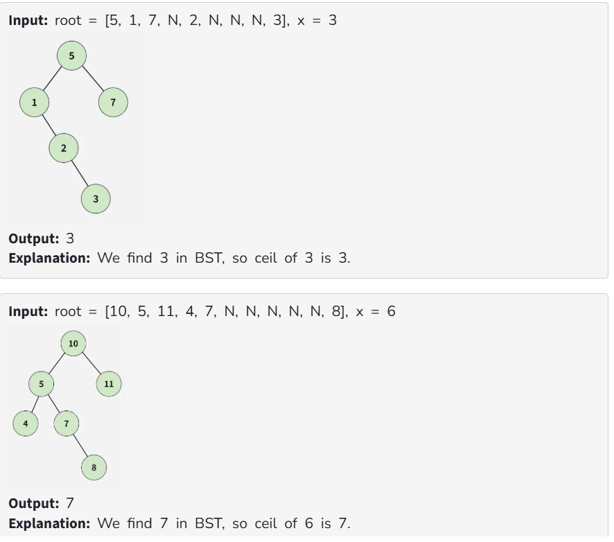

You are given a root binary search tree and an integer x . Your task is to find the Ceil of x in the tree.

Note: Ceil(x) is a number that is either equal to x or is immediately greater than x.

If Ceil could not be found, return -1.

Constraints:

1  ≤ Number of nodes  ≤ 10^5

1  ≤ Value of nodes ≤ 10^5

