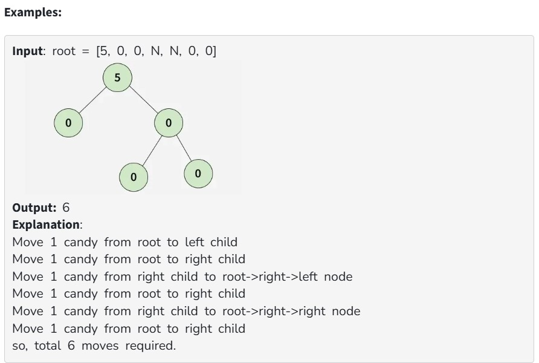

You are given the root of a binary tree with n nodes, where each node contains a certain number of candies, and the total number of candies across all nodes is n. In one move, you can select any two adjacent nodes and transfer one candy from one node to the other. The transfer can occur between a parent and child in either direction.

The task is to determine the minimum number of moves required to ensure that every node in the tree has exactly one candy.

Note: The testcases are framed such that it is always possible to achieve a configuration in which every node has exactly one candy, after some moves.

Constraints:
1 ≤ n ≤ 3*10^3

0 ≤ Node->data ≤ n

The sum of all Node->data = n
