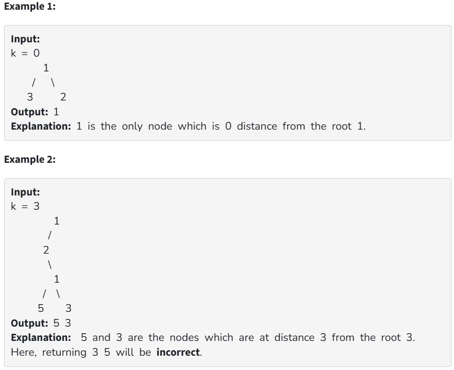

Given a binary tree having n nodes and an integer k. Print all nodes that are at distance k from the root (root is considered at distance 0 from itself). Nodes should be printed from left to right.

our Task:
You don't have to take input. Complete the function Kdistance() that accepts root node and k as parameters and returns the value of the nodes that are at a distance k from the root.

Constraints:

1 <= n <= 10^4

0 <= k <= 30
