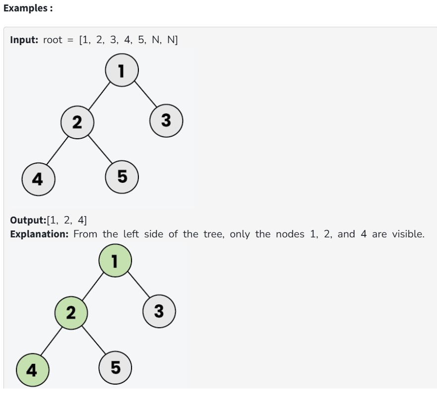
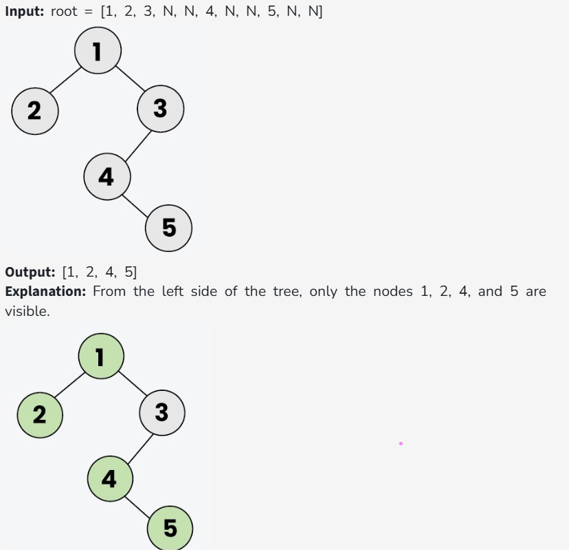

Given the root of a binary tree. Your task is to return the left view of the binary tree. The left view of a binary tree is the set of nodes visible when the tree is viewed from the left side.

Note: If the tree is empty, return an empty list.

Constraints:

0 ≤ number of nodes ≤ 10^5

0 ≤ node -> data ≤ 10^5

