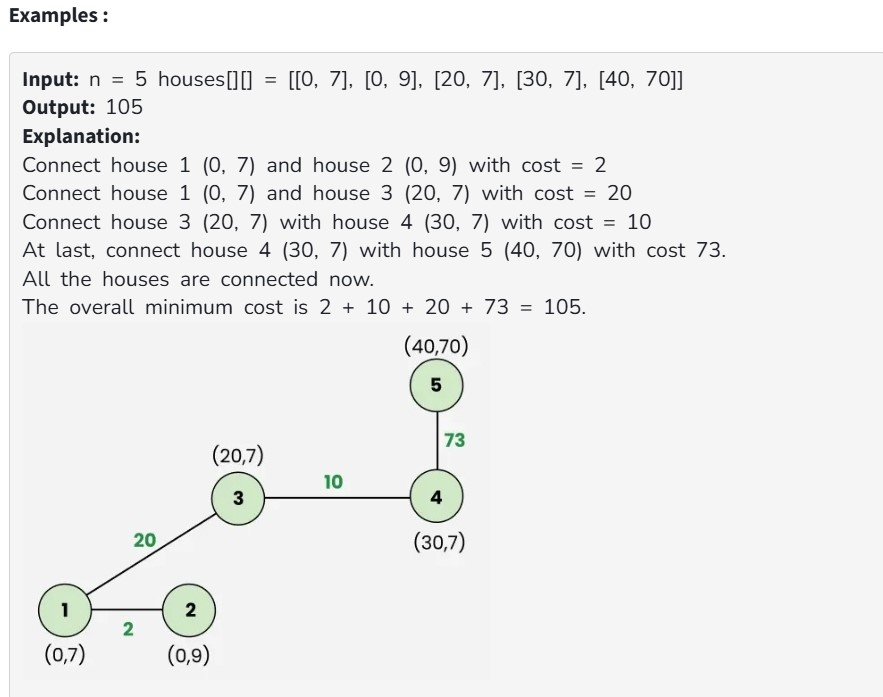
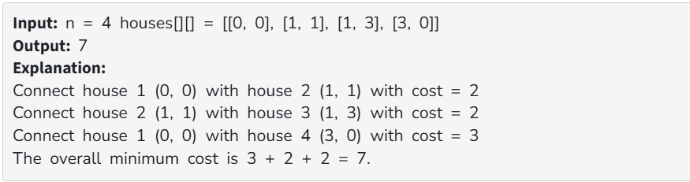

Given a 2D array houses[][], consisting of n 2D coordinates {x, y} where each coordinate represents the location of each house, the task is to find the minimum cost to connect all the houses of the city.

The cost of connecting two houses is the Manhattan Distance between the two points (xi, yi) and (xj, yj) i.e., |xi – xj| + |yi – yj|, where |p| denotes the absolute value of p.

Constraint:

1 ≤ n ≤ 10^3

0 ≤ houses[i][j] ≤ 10^3

