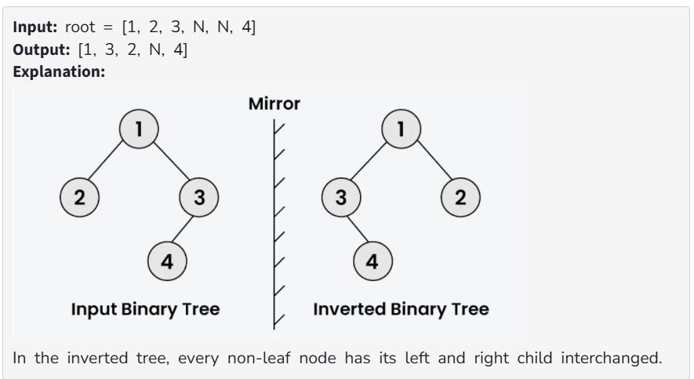
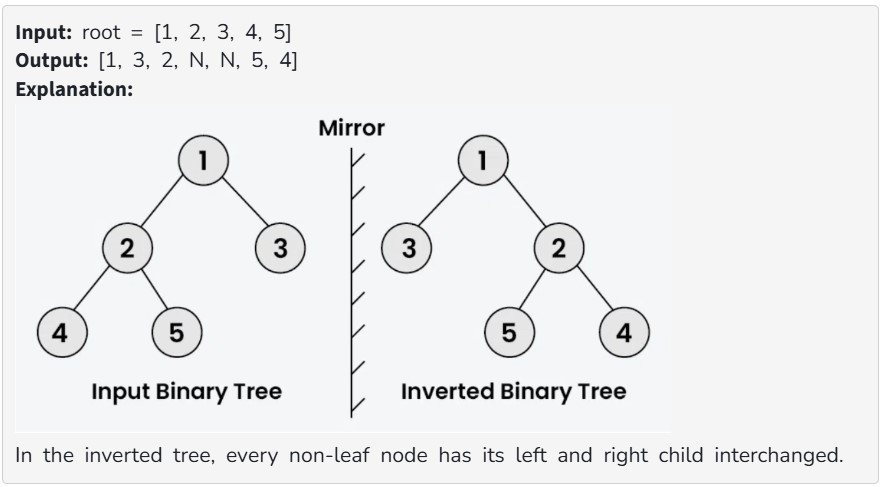

Given the root of a binary tree, convert the binary tree to its Mirror tree.

Note: Mirror of a Binary Tree T is another Binary Tree M(T) with left and right children of all non-leaf nodes interchanged.

Constraints:
1 ≤ number of nodes ≤ 10^4

1 ≤ node->data ≤ 10^5

