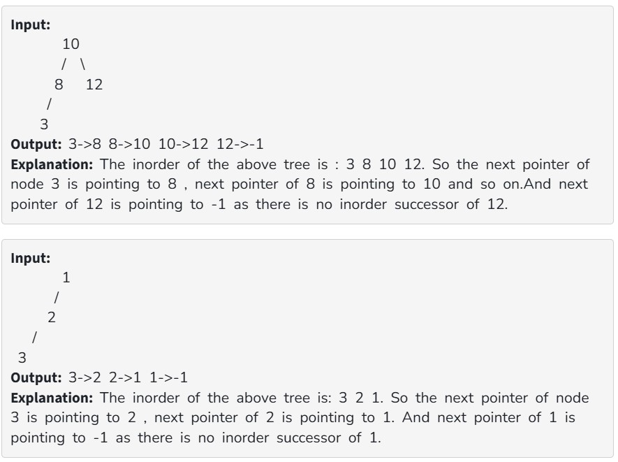

Given a Binary Tree, complete the function to populate the next pointer for all nodes. The next pointer for every node should point to the Inorder successor of the node.
You do not have to return or print anything. Just make changes in the root node given to you.

Note: The node having no in-order successor will be pointed to -1. You don't have to add -1 explicitly, the driver code will take care of this.

Expected Time Complexity: O(n)

Expected Auxiliary Space: O(logn)

Constraints:

1<= no. of nodes <=10^5

1<= data of the node <=10^5
