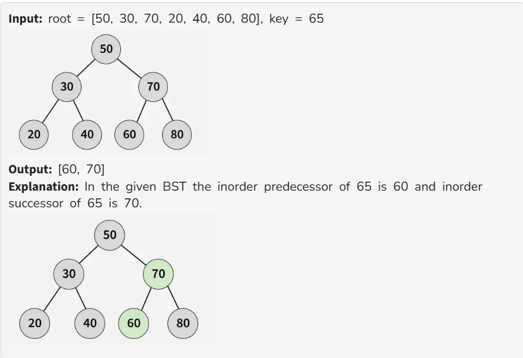
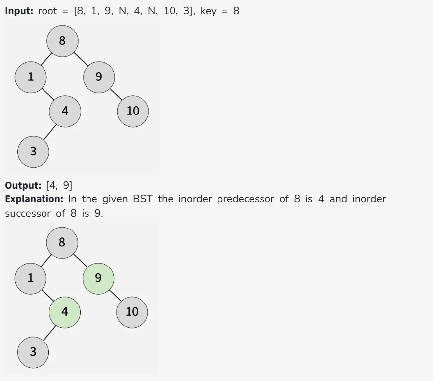

You are given the root of a BST and an integer key. You need to find the inorder predecessor and successor of the given key. If either predecessor or successor is not found, then set it to NULL.

Note: In an inorder traversal the number just smaller than the target is the predecessor and the number just greater than the target is the successor. 

Constraints: 

1 ≤ no. of nodes ≤ 10^5

1 ≤ node->data ≤ 10^6

1 ≤ key ≤ 10^6
