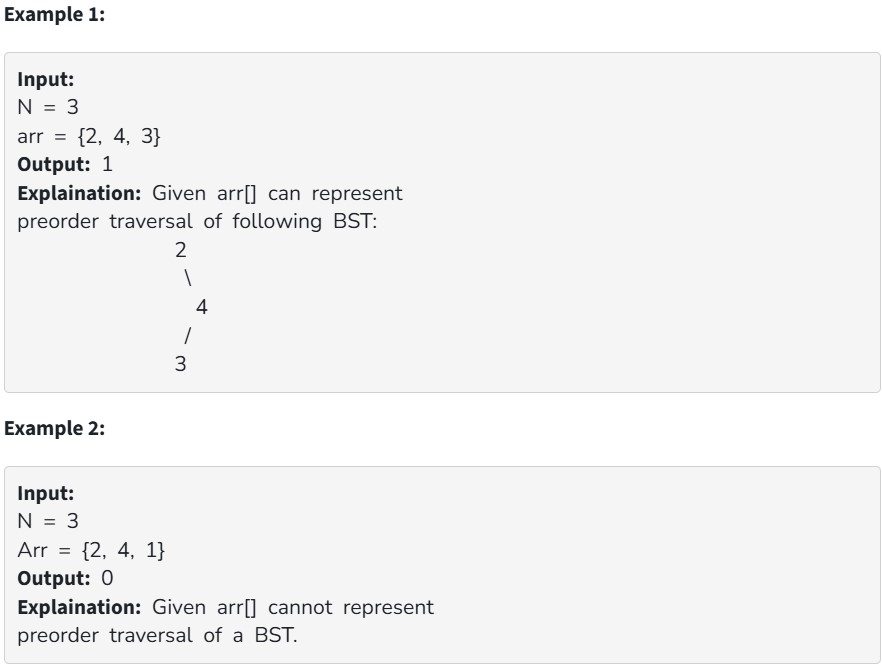

Given an array arr[ ] of size N consisting of distinct integers, write a program that returns 1 if given array can represent preorder traversal of a possible BST, else returns 0.

Your Task:
You don't need to read input or print anything. Your task is to complete the function canRepresentBST() which takes the array arr[] and its size N as input parameters and returns 1 if given array can represent preorder traversal of a BST, else returns 0.

Expected Time:
Complexity: O(N)

Expected Auxiliary:
Space: O(N)

Constraints:

1 ≤ N ≤ 10^5

0 ≤ arr[i] ≤ 10^5
