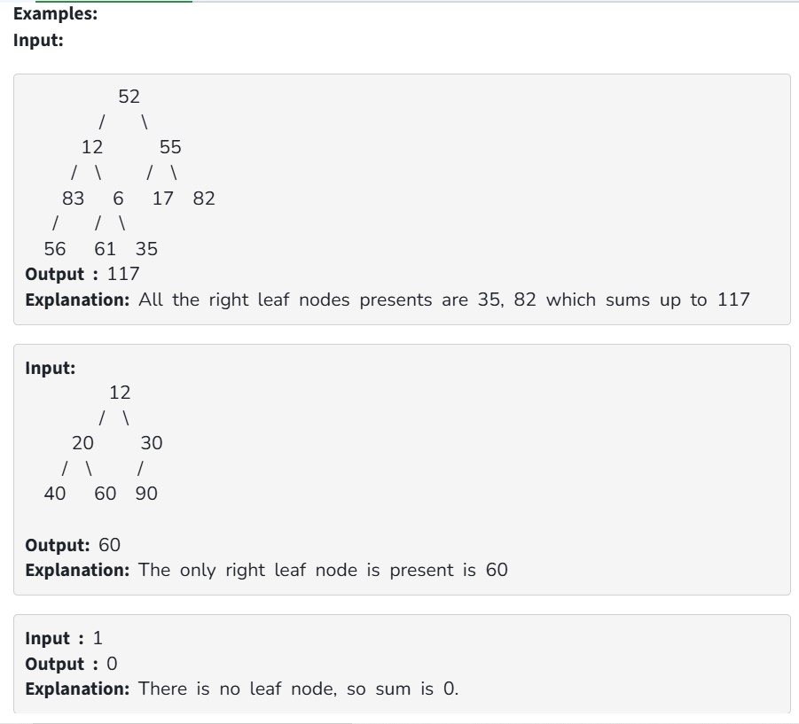

Given a Binary Tree. Your task is to complete the function rightLeafSum(), which should return the sum of all the leaf nodes that are the right child of their parent of the given binary tree.

Constraints:

1 <= number of nodes <=10^6

1 <= node->data <=10^5

It is guaranteed that sum will not exceed integer max value
