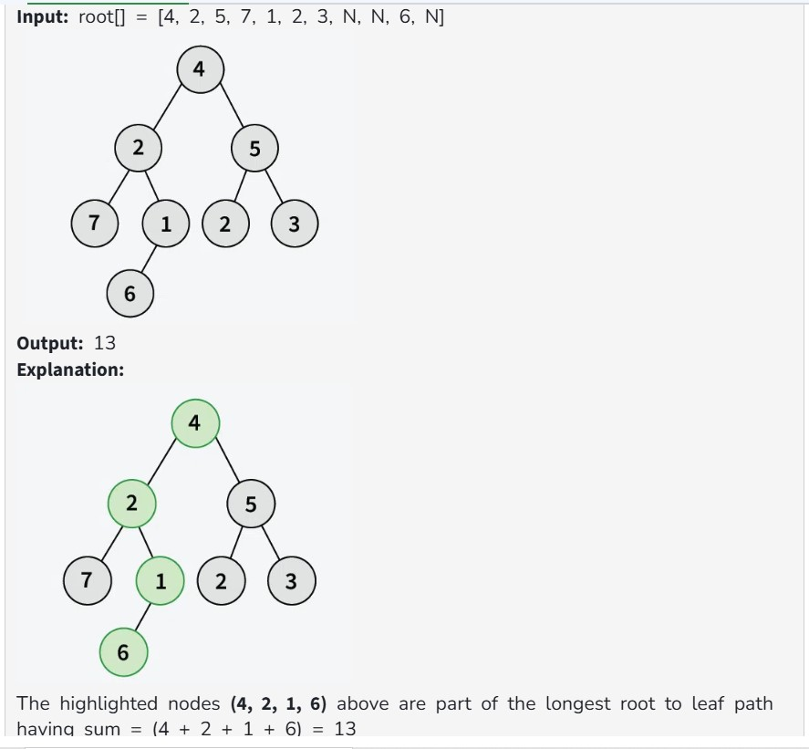
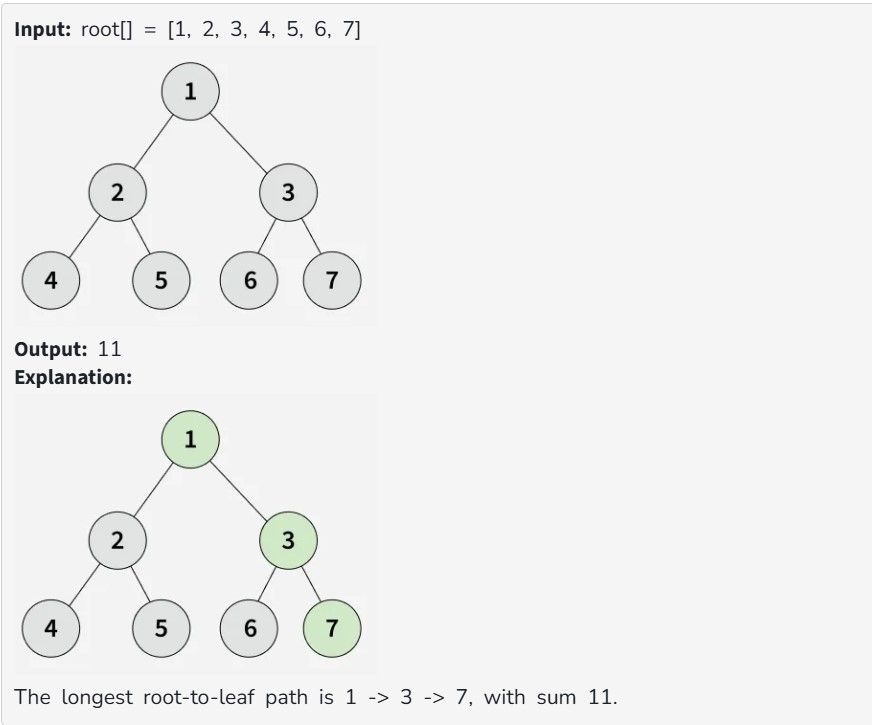
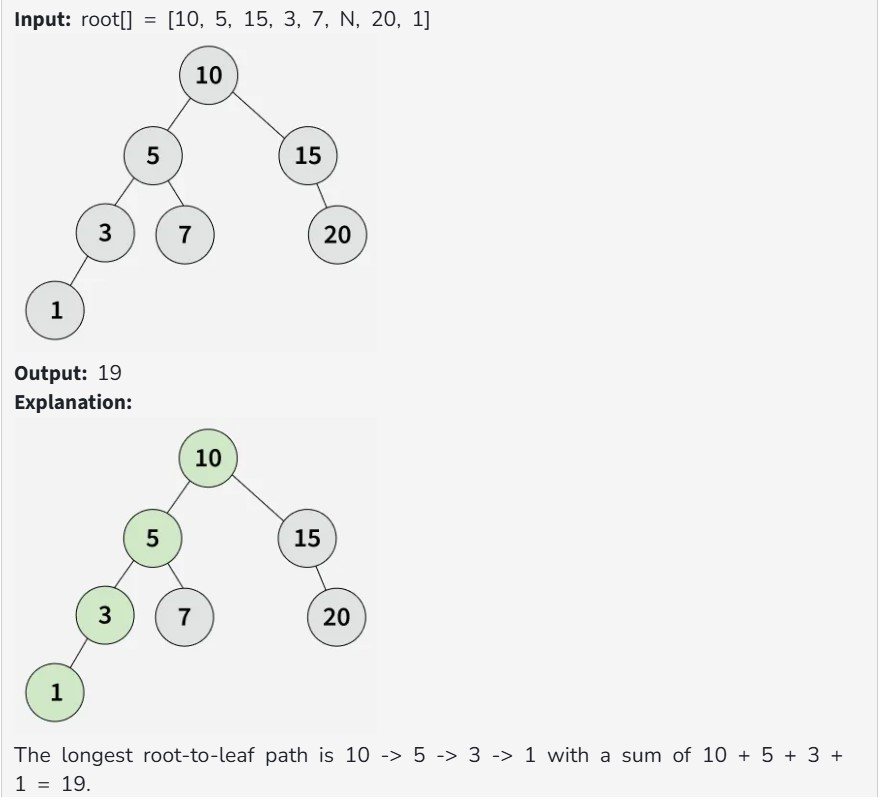

Given a binary tree root[], you need to find the sum of the nodes on the longest path from the root to any leaf node. If two or more paths have the same length, the path with the maximum sum of node values should be considered.

Examples:

Constraints:

1 <= number of nodes <= 10^6

0 <= node->data <= 10^4
