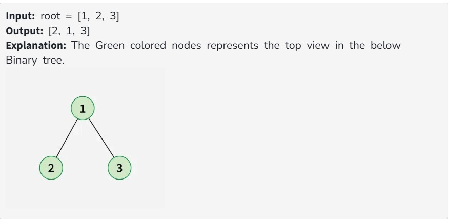
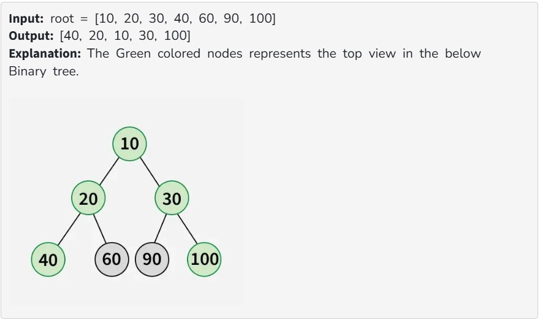

You are given the root of a binary tree, and your task is to return its top view. The top view of a binary tree is the set of nodes visible when the tree is viewed from the top.

Note:

Return the nodes from the leftmost node to the rightmost node.

If multiple nodes overlap at the same horizontal position, only the topmost (closest to the root) node is included in the view. 

Examples:

Constraints:

1 ≤ number of nodes ≤ 10^5

1 ≤ node->data ≤ 10^5
