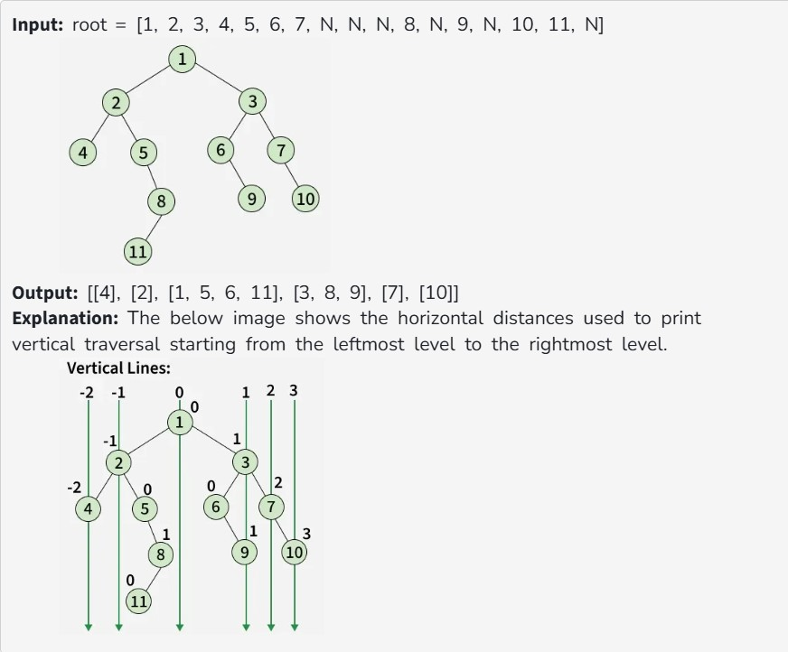
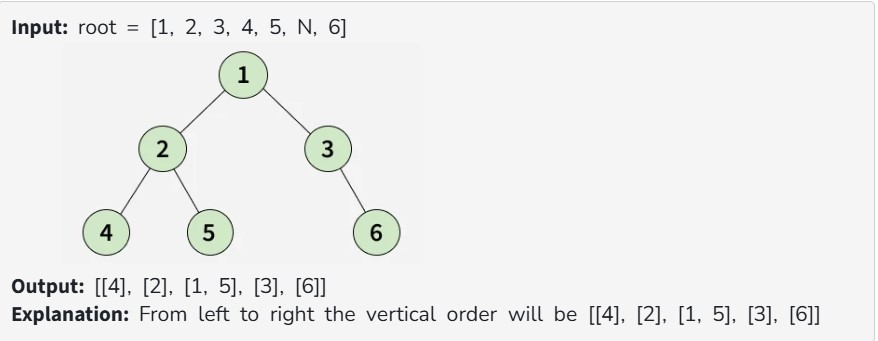

Given the root of a Binary Tree, find the vertical traversal of the tree starting from the leftmost level to the rightmost level.

Note: If there are multiple nodes passing through a vertical line, then they should be printed as they appear in level order traversal of the tree.

Examples:

Constraints:

1 ≤ number of nodes ≤ 10^5

1 ≤ node->data ≤ 10^5
